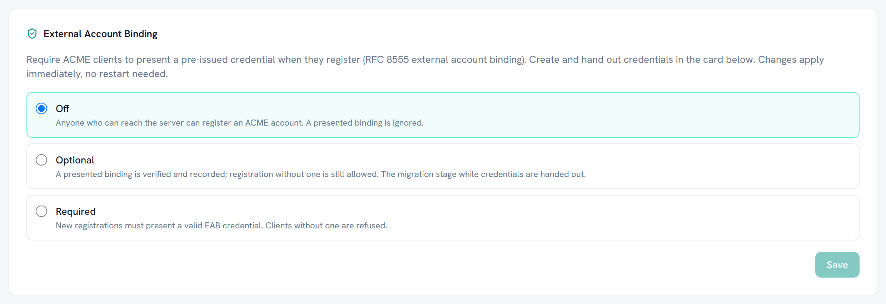

# External account binding

External account binding (RFC 8555 section 7.3.4) decides **who may register an
ACME account** with your server. This page is the administrator's half. For the
client flags, see [connecting ACME clients](acme-clients.md).

Administration lives on the **ACME** tab of the dashboard.

## Enforcement modes

| Mode | What a registering client needs |
|---|---|
| Off | Nothing. A presented binding is ignored. This is the default |
| Optional | Nothing, but a presented binding is verified and recorded |
| Required | A valid credential. Registration without one is refused with `externalAccountRequired` |

The mode applies immediately when you change it. There is no restart, and an
upgrade from a version without this feature reads as Off, so nothing changes
underneath an existing install. Re-running the setup wizard on a configured
server does not reset it either.

**Raising the mode to Required does not lock out accounts that already exist.**
Accounts registered before the change keep working, and the ACME page lists
them as Unbound so you can see which they are. If you want them gone,
deactivate them deliberately; nothing does it for you.

## Issuing a credential

A credential is a **key id** and an **HMAC key**. The key id is 32 hexadecimal
characters. The HMAC key is sized for HS256, which is what every common client
signs with by default, and HS384 and HS512 are accepted too.

**The HMAC key is shown exactly twice in its life: when you create it, and when
you regenerate it.** It is not in any list, any error body, or any log line,
and the API will not return it again. Hand both values to the client operator
at the moment you create them.

The dashboard writes ready to paste client setup for you. The panel shown right
after create or regenerate has the real secret inlined; each credential row's
**Client setup** action shows the same snippets later with a placeholder where
the secret goes.

## Revoking, expiring, and the difference

**Revocation is terminal.** A revoked credential refuses edit, regenerate and
owner change alike. There is no un-revoke. If you need the holder back, issue a
new credential.

**Expiry is not terminal.** An expired credential is suspended, not dead. Move
the expiry date forward, or clear it, and it works again.

Both suspend the accounts bound to them, and they do it at two points: when a
new order is created, and at finalize. A suspended account gets 403
`unauthorized`.

The order itself stays in the `ready` state when this happens. That is
deliberate: if you un-suspend the credential, the client can retry the same
order rather than starting over.

## Domain namespaces

A credential can carry a domain namespace, which limits what the accounts bound
to it may order, across every template.

A namespace **narrows within the global allowed domain list, it never widens
past it.** The global list is the ceiling and is checked first, so putting a
domain in a namespace that the global list does not permit does not make it
orderable. If you want a credential to reach a new domain, add it to the global
list first.

A credential with no namespace is unrestricted, subject to the global list like
any other.

An order outside the namespace is refused with `rejectedIdentifier` and a
message naming the credential, and the refusal is recorded on the dashboard
activity feed labelled as an EAB refusal, so it is distinguishable from a
global allowed domain refusal.

## Linking a credential to a person or a machine

A credential can record which Active Directory principal it was issued to.
Users, computers, groups and service accounts can all be picked, including
group managed service accounts, which are the usual identity for an automated
ACME client.

**This link is a record, not a control.** Nothing checks it at issuance time. It
exists so that six months later you can answer "who has this credential"
without consulting a spreadsheet.

## Moving the data folder breaks the secrets, on purpose

Credential secrets are encrypted with the machine's Data Protection keyring,
which lives in `keys\` inside the data folder and is tied to the machine.

Restore the data folder onto a different machine and the secrets can no longer
be decrypted. Verification then **fails closed**: clients get 403
`unauthorized` and the log says to regenerate.

This is the intended behaviour, not a defect. It means a copy of your data
folder is not a copy of your credentials.

Recovery is straightforward, because everything except the secret survives the
move. The key id, name, expiry, namespace and owner are all stored in the
clear:

1. Open the ACME page on the new machine. Your credentials are all listed.
2. Regenerate each one. **The key id stays the same**, so only the HMAC key has
   to be redistributed.
3. Give each client operator the new HMAC key.

See [backup and restore](backup-and-restore.md) for how to avoid the situation.

## EAB and device attestation do not mix

The Apple ACME payload has nowhere to put EAB credentials, so a device using
`device-attest-01` cannot present one.

The consequence is concrete: **with enforcement set to Required, Apple devices
cannot register at all.** That is not a bug and it is not fixable at this end.

Separate templates do not get round this. The enforcement mode is one setting
for the whole server, not one per template, and an ACME account works on every
template's directory, so Required refuses a new device on every template alike.
An account a device registered before the mode was raised keeps working, but
any new registration is refused, a device enrolling again included. If you use
device attestation, keep the mode at Off or Optional; the device attestation
allowlist, not EAB, is the gate for device orders. See
[device attestation](device-attestation.md).
