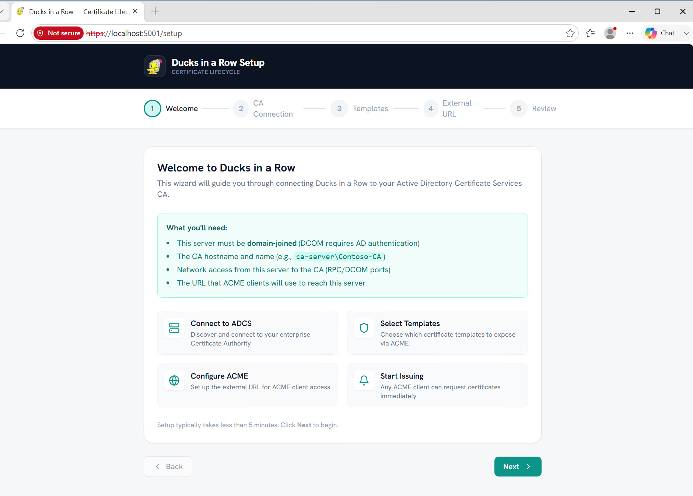
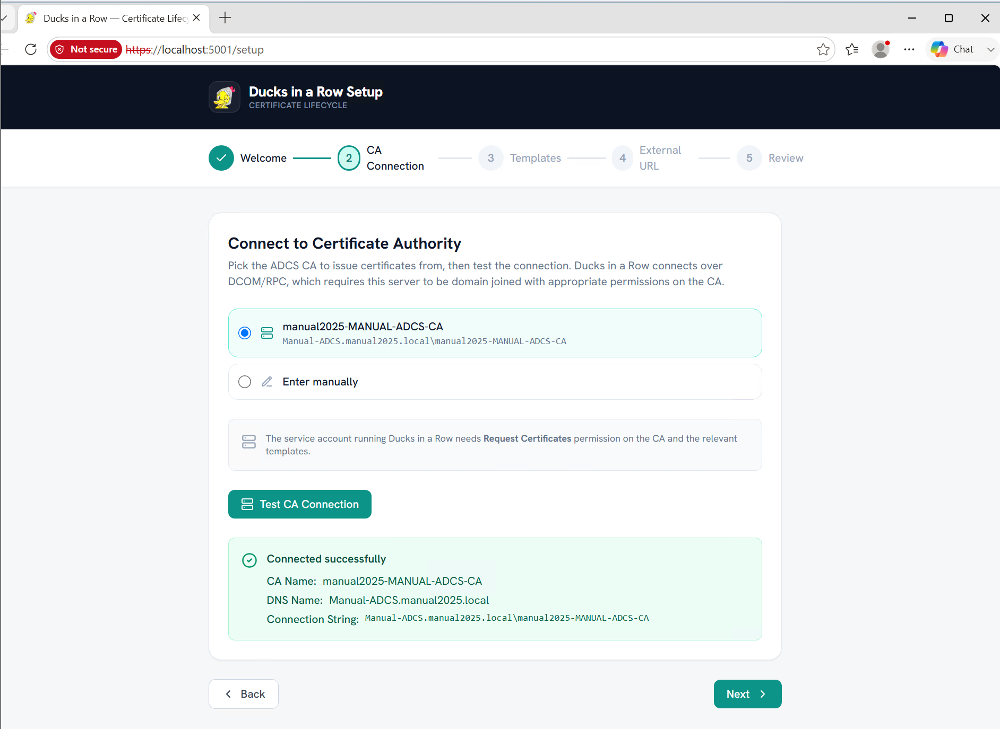
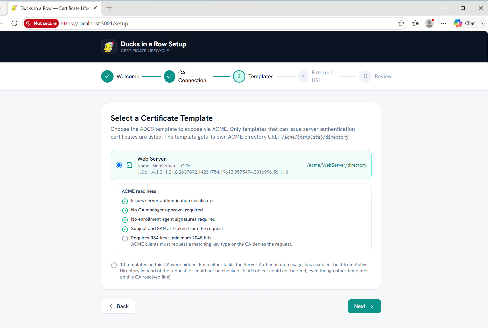
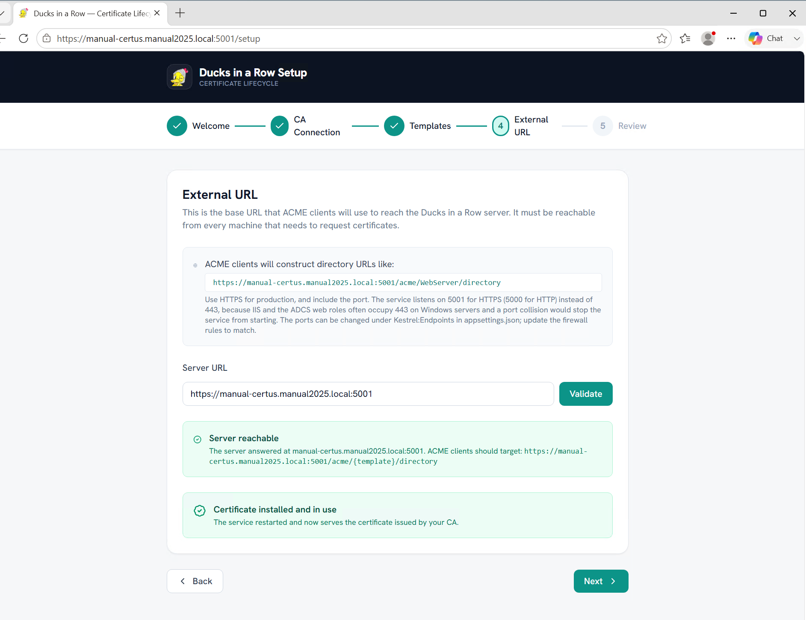
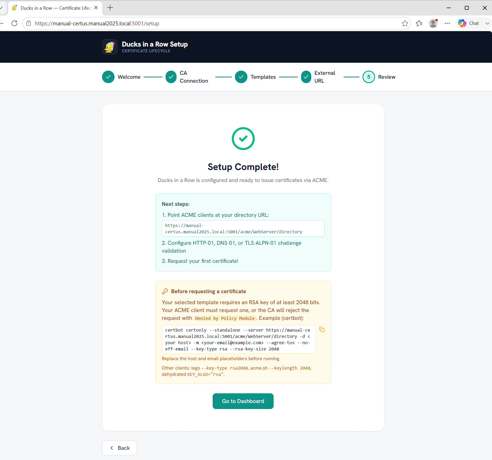
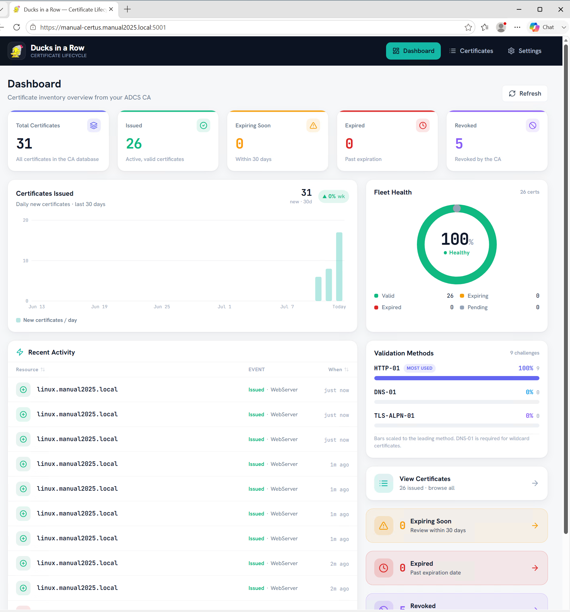

# Quickstart

Get from a fresh install to your first issued certificate. Plan for about
fifteen minutes the first time, most of it spent on Active Directory
permissions.

> New to ACME or ADCS? The [glossary](glossary.md) explains the key terms.

## Before you start

You need:

- A Windows Server that is **domain joined** to the same forest as your ADCS
  certificate authority.
- The **ADCS Remote Administration Tools** installed on that server. They
  register the COM classes Ducks in a Row uses to talk to the CA:

  ```powershell
  Install-WindowsFeature RSAT-ADCS-Mgmt
  ```

- The server's **machine account** granted, on the CA:
  - **Enroll** on each certificate template you want to expose, and
  - **Read** on the CA itself (Certification Authority console, CA properties,
    Security tab). Read is what lets the dashboard sync the certificate
    inventory. Without it, enrolment still works but the dashboard stays empty.
- Optional: your CA connection string in `CAHOST\CA Name` form. The setup
  wizard discovers the CAs published in Active Directory on its own; you only
  need the string for manual entry. Find it with:

  ```powershell
  certutil -config - -ping
  ```

## 1. Install

Download the installer from the
[latest release](https://github.com/haruspexsystems/Ducks-in-a-Row/releases) and run
it on the server. This is a beta and the installer is not code signed, so
Windows SmartScreen and Defender will warn you when you run it; verify the
download against the SHA256 checksum on the release page first. The install
wizard lets you:

- choose the destination folder (default `C:\Program Files\Ducks in a Row\`),
- choose the data folder for the database, logs, and runtime configuration
  (default `C:\ProgramData\Ducks in a Row\`),
- choose whether to start the service immediately,
- open the setup page in your browser from the completion screen.

In all cases the installer:

- copies the application to the destination folder you chose,
- creates the data folder and records its location in the registry so the
  service finds it,
- registers the Windows service **DucksInARow** (display name "Ducks in a Row
  Certificate Proxy", runs as LocalSystem, set to start automatically on boot),
- opens inbound firewall rules on **TCP 5000** (HTTP) and **TCP 5001** (HTTPS),
- adds a **Ducks in a Row** Start Menu shortcut to the web UI.

### Unattended install

```
msiexec /i Ducks-in-a-Row.msi /qn INSTALLFOLDER="D:\Ducks in a Row" DATAFOLDER="D:\DucksData" START_SERVICE=0
```

- `INSTALLFOLDER`: destination folder (optional; defaults to
  `C:\Program Files\Ducks in a Row`).
- `DATAFOLDER`: data folder (optional; defaults to
  `C:\ProgramData\Ducks in a Row`). Choose it at install time; moving it on a
  later upgrade is not supported.
- `START_SERVICE`: `1` (default) starts the service after install; `0` registers
  it but leaves it stopped until the next boot or a manual start.

The "open the setup page" prompt only appears in the interactive wizard, so a
`/qn` install never launches a browser.

## 2. Run the setup wizard

Open the dashboard in a browser on `https://your-server:5001` (or
`http://your-server:5000`). You must sign in as a member of the administrator
group. By default that is the server's built in Administrators group; set
`Auth:AdminGroup` in `appsettings.json` to delegate to a specific Windows or
Active Directory group.

> The HTTPS endpoint uses a self signed certificate out of the box (generated in
> the data folder as `ducks-selfsigned.pfx`), so your browser will warn on
> first visit. For production, give Ducks in a Row a certificate your clients
> already trust (see
> [Giving clients a TLS certificate they trust](#giving-clients-a-tls-certificate-they-trust)
> below).

Until setup completes the service is **unconfigured**: it serves the wizard and
the dashboard shell, and every CA operation answers 503. It never falls back to
a fake CA on its own.

On first run you are taken to the setup wizard. It walks you through five short
steps.



1. **Welcome.** A short checklist of what you need before you start.
2. **Connect a CA.** The wizard discovers the CAs published in Active Directory
   and lets you pick one, or enter `CAHOST\CA Name` by hand. It then tests the
   connection through the same DCOM path the service uses in production.

   

3. **Choose a template.** It lists the templates that CA publishes, checks each
   one for ACME readiness, and lets you choose the template to expose.

   

4. **Set the external URL.** This is the address clients will use to reach the
   server. It comes prefilled with a suggestion and is checked for you. On this
   step the wizard can also enrol an HTTPS certificate for the server from your
   CA in one click, so clients trust the connection (see
   [Giving clients a TLS certificate they trust](#giving-clients-a-tls-certificate-they-trust)).

   

5. **Review and apply.** Your choices are saved to `settings.json` in the data
   folder and the service restarts itself to load them. The wizard waits for the
   service to come back, then shows a ready to run certbot command and opens the
   dashboard.

   

To point an existing install at a different CA later, you have two options.
Either edit `Certus:CaConnectionString` in `settings.json` in the data folder
and restart the service, or clear that value and restart to reopen the wizard.
Setup locks once it is complete, so the wizard will not reopen while a CA is
still configured.

## 3. Request your first certificate

Each certificate template is its own ACME endpoint:

```
https://your-server:5001/acme/<template>/directory
```

`<template>` is the template's programmatic name (its AD `cn`) or its display
name. Display names with spaces work; the client URL encodes them.

Point any standard ACME client at that directory URL and request a certificate.
A quick test with certbot:

```bash
certbot certonly --standalone \
  --server https://your-server:5001/acme/WebServer/directory \
  --email you@example.com \
  -d host.corp.example.com \
  --key-type rsa --rsa-key-size 2048
```

> **Key type.** If your ADCS template uses an RSA CSP (the default
> `Web Server ACME` template does), your ACME client must request an RSA key.
> Most modern clients default to elliptic curve keys, which the CA policy
> module rejects at finalize with `Denied by Policy Module`. The last line
> above forces RSA for certbot. Other clients: lego `--key-type rsa2048`,
> acme.sh `--keylength 2048`, dehydrated `KEY_ALGO="rsa"`.

No account pre-registration or external account binding is needed. The client
creates an account from its own key on first use.

See [Connecting ACME clients](acme-clients.md) for certbot, win-acme, Caddy,
Traefik, and Posh-ACME.

## 4. Confirm it worked



- The client writes out the issued certificate and chain.
- The certificate appears in the dashboard inventory within one sync cycle
  (every 5 minutes by default, `Certus:SyncIntervalMinutes`).
- The health endpoint reports healthy:

  ```powershell
  Invoke-RestMethod https://your-server:5001/health
  ```

If anything misbehaves, see [Troubleshooting](troubleshooting.md).

## Configuration reference

Configuration is layered. Shipped defaults live in `appsettings.json` in the
installation folder; the setup wizard writes instance settings (CA connection
string, external URL) to `settings.json` in the **data folder**, which
overrides them and survives upgrades. Environment variables override both.
Restart the service after editing either file.

| Setting | Default | Purpose |
|---|---|---|
| `Certus:CaConnectionString` | `null` (unconfigured; the wizard sets it) | ADCS CA in `CAHOST\CA Name` form |
| `Certus:DatabasePath` | `ducks.db` in the data folder | SQLite database file |
| `Certus:ExternalUrl` | `null` | The base URL you expect clients to use. Recorded and checked at startup; ACME URLs themselves follow the host the client connects to |
| `Certus:SyncIntervalMinutes` | `5` | How often the dashboard syncs from the CA |
| `Auth:Mode` | `Negotiate` | Windows Integrated Authentication for the dashboard |
| `Auth:AdminGroup` | `null` (built in Administrators) | Group allowed into the dashboard and setup |
| `Auth:RequireHttps` | `true` | HSTS and HTTP to HTTPS redirect outside development |
| `Auth:TrustedProxies` | `[]` | Reverse proxy IPs whose `X-Forwarded-*` headers are trusted |

### Giving clients a TLS certificate they trust

ACME clients refuse to connect to an ACME server whose own TLS certificate they
do not trust. The easiest fix is built into the app: on the external URL step,
the setup wizard can enrol an HTTPS certificate for this server from the CA you
connected, install it, and reload the service to serve it. The **Settings** page
can renew that certificate later. Try these built in options first.

If you would rather supply your own certificate (for example, one from a
different issuer), point Kestrel at a PFX file instead:

```json
"Kestrel": {
  "Endpoints": {
    "Https": {
      "Url": "https://0.0.0.0:5001",
      "Certificate": {
        "Path": "C:\\ProgramData\\Ducks in a Row\\ducks.pfx",
        "Password": "your-pfx-password"
      }
    }
  }
}
```

For a quick lab test only, you can set `Auth:RequireHttps` to `false` and use
plain HTTP on port 5000 instead.

See the Alert Configuration section of the
[Installation Guide](Ducks-in-a-Row-Installation-Guide.pdf) for SMTP and webhook expiry
notifications, or the [Troubleshooting](troubleshooting.md) page for common
issues.
