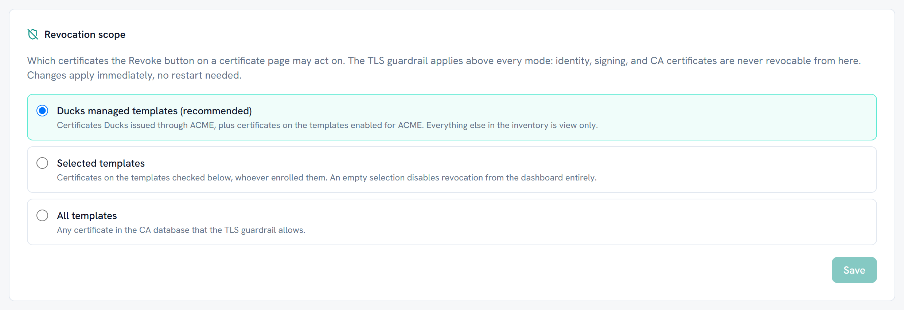

# Revocation

Ducks in a Row can revoke a certificate from the dashboard, and an ACME client
can revoke its own. What the dashboard may touch is deliberately narrow, and it
is narrowed by two independent things: a ceiling you cannot raise, and a scope
you choose.

## The ceiling you cannot raise

Before any setting is consulted, a certificate must clear a capability ceiling.
It is revocable from the dashboard only when all of these hold:

- It has an extended key usage extension, and that extension is **not empty**.
- Every purpose in it is server authentication or client authentication, and
  nothing else.
- Its key usage does not include certificate signing or CRL signing.
- It is not a CA certificate.

A certificate whose capability cannot be determined at all, because there is no
stored copy of it and no parsed detail, is refused rather than allowed. The
ceiling fails closed.

**No administrator setting widens this.** There is no configuration key, no
break glass flag, and no dashboard control that lets the ceiling through. It is
a subset rule, not a blacklist: a purpose nobody anticipated is outside the
allowed set by construction, so it is refused without anyone having to think of
it in advance.

The reason is blunt. A tool that proxies certificate requests should not be able
to revoke a domain controller certificate, a code signing certificate, or the
CA's own certificate. Those are exactly the revocations that take an
organisation down, and none of them is a TLS certificate.

> **A certificate with no EKU at all is refused.** An empty or absent EKU
> extension means valid for every purpose, which is the opposite of a narrow TLS
> certificate. It reads as unlimited, so the ceiling treats it that way.

## The scope you choose

Underneath the ceiling, `revocationScope` decides which of the remaining
certificates the dashboard offers to revoke. Set it on the Settings page.

| Mode | What the dashboard may revoke |
|---|---|
| `ducks-managed` | The default. Certificates Ducks in a Row issued, plus anything on a template you enabled for ACME |
| `custom` | Only certificates on the templates you list |
| `all` | Anything that clears the ceiling |

Ducks managed is a union of two tests, and either one is enough: the
certificate has an ACME record bridging it to a request this server made, or its
template is one you enabled for ACME. The first covers certificates this server
obtained. The second covers certificates on the same templates that something
else obtained, which is usually what an administrator means by "ours".

`custom` with an empty template list disables dashboard revocation entirely.
That is a legitimate configuration, and the startup log says so plainly rather
than leaving you to wonder.

`all` is logged as a warning at every start. It is not forbidden, but it is
worth being deliberate about.

> **Template names are matched in both forms.** A template can be recorded under
> its programmatic name or its display name, so the match tries the stored form
> first and then maps display name to programmatic name through the list the CA
> publishes. If the CA is unreachable, only the raw match is available, so the
> scope narrows rather than widens. That is the safe direction.

`Certus:Acme:ExposeAllTemplates` does **not** widen revocation. The scope reads
the recorded template selection directly rather than going through the ACME
exposure policy, precisely so that an ACME break glass stays an ACME break
glass and does not quietly become a revocation one.

## What the CA has to allow

Dashboard revocation needs the server's machine account to hold **Issue and
Manage Certificates** on the CA, which is a higher privilege than the **Read**
that the inventory needs and the **Enroll** that issuance needs.

Granting it is a real decision. Without it, everything else keeps working and
revocation returns a permission error naming the right that is missing. If you
do not intend to revoke from the dashboard, do not grant it: the ceiling and the
scope are defence in depth on top of the CA's own permissions, not a replacement
for them.

## ACME clients revoking their own certificates

An ACME client can revoke a certificate it holds through the standard
`revoke-cert` endpoint, authorised the way RFC 8555 section 7.6 requires: either
from the account that ordered it, or by proving possession of the certificate's
own private key.

**This path is not subject to the scope modes.** A client revoking its own
certificate is responding to something it knows about, usually a key compromise,
and that must not wait on a dashboard setting an administrator chose months
earlier. It only ever reaches certificates Ducks in a Row issued, so the blast
radius is already bounded.

## The one automatic revocation

There is exactly one place where the product revokes a certificate without being
asked. At finalize, the certificate the CA returns is checked against the
capability ceiling before it is handed to the client. A leaf that breaches the
ceiling is revoked immediately, with reason code 5, and the order fails.

That is the guarantee behind the advisory check at new order time: a template's
recorded metadata is unverified and might be wrong, but the certificate itself
is checked every time and cannot be wrong. If a template is misconfigured so
badly that it mints something outside the ceiling, the client never receives it.

Nothing else revokes on its own. In particular, an order that is abandoned or
expires while the CA is holding it does not revoke anything: it logs the CA
request id at warning level and leaves the decision to an operator. Automatic
revocation of something a human might still want is the more dangerous mistake.

## Where refusals show up

Every refusal, whether by the ceiling or by the scope, is recorded on the
dashboard activity feed with the reason. If a certificate you expected to be
revocable is not offered, that feed says which of the two stopped it.
