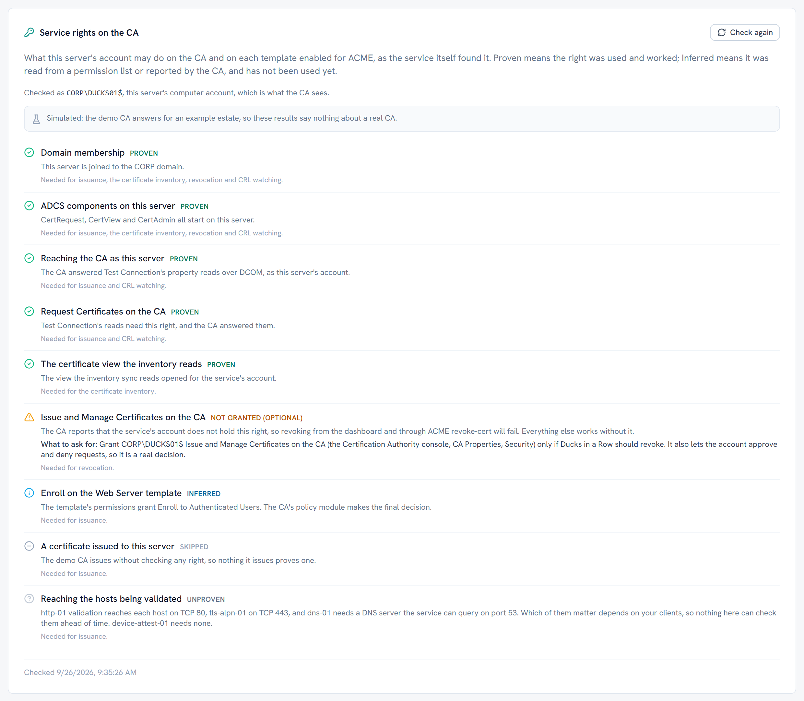

# Verifying your installation

Seven checks, in the order worth running them. Each one says where to go next
when it fails, which for most of them is a section of
[troubleshooting](troubleshooting.md).

## The installed files carry our signature

Every `.exe` and `.dll` the installer puts in the application folder is signed
by Haruspex Systems B.V., so two commands tell you whether the binaries on disk
are the ones we published. Point them at the folder you installed into if you
changed it.

```powershell
$installed = Get-ChildItem "C:\Program Files\Ducks in a Row" `
  -Recurse -Force -File -Include *.exe, *.dll
$installed.Count      # how many were checked. Zero means the path is wrong

$installed | Get-AuthenticodeSignature | Where-Object {
    $null -eq $_.SignerCertificate -or
    $_.Status -ne 'Valid' -or
    $_.SignerCertificate.Subject -notlike 'CN=Haruspex Systems B.V.,*'
  } | Format-List Path, Status, StatusMessage
```

A count with no rows under it is the answer you want. `-Force` is part of the
check and not a detail: without it a file with the hidden attribute is skipped
in silence. Keep the null test first as well: the two tests after it read a
certificate that an unsigned file does not have.

A row is not proof of tampering on its own, so read it before acting.

- **`HashMismatch`, or `Valid` for a file signed by somebody else.** The file is
  not the one we published. Run `Get-AuthenticodeSignature` on it by itself to
  see who signed it, then stop the service, keep the file and
  `logs\ducks-<date>.log` as they are, and write to security@haruspex.systems
  about that first occurrence rather than reinstalling over the evidence.
- **The same complaint on every file at once**, usually `UnknownError` or an
  untrusted chain. That is normally something duller: a server with no internet
  access, which cannot finish building or checking our certificate's chain.
  Compare the installer against the SHA256 checksum instead, as [checking the
  download](installation.md#check-the-download) describes. One file alone saying
  it belongs in the case above instead: a chain this server cannot check would
  not leave the rest of them clean.

This covers the binaries and not the rest: configuration files and the
dashboard's own files are installed unsigned. Every binary it does cover carries
the same publisher, which is what lets one publisher rule in an App Control for
Business (WDAC) or AppLocker policy allow all of them, and this check is how you
confirm that before writing the rule.

## The service is running

```powershell
Get-Service DucksInARow

# Status   Name          DisplayName
# ------   ----          -----------
# Running  DucksInARow   Ducks in a Row Certificate Proxy
```

A service that is not running has almost always logged the reason. Read
`logs\ducks-<date>.log` in the data folder before anything else.

## Health

```powershell
Invoke-RestMethod https://your-server:5001/health
```

| State | Meaning |
|---|---|
| Healthy | The database is reachable and so is the CA |
| Degraded | The database is fine, the CA is not reachable |
| Unhealthy | The database is not reachable |

`Degraded` is the interesting one: the service is up and answering, but no
certificate can be issued until the CA comes back. Alerts and the dashboard keep
working, and ACME clients get a 503 that tells them to retry rather than an
error that makes them give up.

There is a second endpoint, `/health/live`, which reports only that the process
is up and answering. Use it for a load balancer probe, where a CA outage should
not take the server out of rotation. Both endpoints are anonymous, so a monitor
does not need credentials.

## The ACME directory answers

```powershell
Invoke-RestMethod https://your-server:5001/acme/WebServer/directory | ConvertTo-Json
```

Substitute a template you actually enabled. A 403 here means the template is not
enabled for ACME, and a 404 means the name does not match a published template.
Both are covered in [troubleshooting](troubleshooting.md).

## The firewall rules exist

```powershell
Get-NetFirewallRule -DisplayName "Ducks in a Row*" |
  Select-Object DisplayName, Enabled, Direction, Action
```

The installer opens inbound TCP 5000 and 5001. If you changed the ports in
`settings.json`, the rules still name the old ones and you need to add your own.

## The dashboard loads

Open `https://your-server:5001` in a browser, signed in as a member of the
administrator group.

The HTTPS endpoint uses a self signed certificate out of the box, so the browser
warns on the first visit. That is expected. See
[quickstart](quickstart.md) for giving the server a certificate your clients
already trust.

If the dashboard loads but the certificate inventory is empty, the machine
account is probably missing **Read** on the CA. Enrolment works without it and
the inventory does not: Request Certificates, which Authenticated Users hold on a
default CA, does not open the certificate database. So an empty dashboard next
to working issuance points straight at that permission. See
[ADCS configuration](adcs-setup.md).

## The CA connection works

The wizard's connection step has a **Test Connection** button. It reads two
properties from the CA through the same DCOM path the service uses in
production, as the service's own computer account. The CA answers those reads
only to an account holding **Request Certificates**, so a pass proves the network
path, DCOM, and that one right.

It proves nothing about the other rights. On a default CA every domain computer
holds Request Certificates through Authenticated Users, so a pass is the start of
the answer, not all of it. The rights check below covers the rest.

If setup is already complete the wizard will not reopen. Use the health endpoint
above, where `Degraded` is the same signal, or the rights check on the Settings
page.

## The service's rights

The wizard checks what the service's own account may do. The CA's rows appear as
soon as Test Connection passes, and the Review step checks everything again,
with one row for each template you chose. The **Service rights on the CA** card
on the Settings page runs the same check against the configured CA and the
templates enabled for ACME. **Check again** reruns it, for when a right has been
granted or taken away since.



Each row reads one of five:

| Status | Meaning |
|---|---|
| Proven | The right was used and it worked, either just now or by the HTTPS certificate this CA issued to the server |
| Inferred | Read, not used: reported by the CA, or read from a template's permissions. Never a pass |
| Unproven | Nothing here could check it, or the check did not answer in time |
| Failed | Used and refused, or read and definitely absent. The row says what to ask for |
| Skipped | Not attempted, because something it depends on failed first |

How each right is established:

- **Request Certificates on the CA** is proven by Test Connection itself.
- **The certificate view the inventory reads** is proven by opening it. The CA
  opens it to an account holding **Read**, and Request Certificates alone does
  not.
- **Issue and Manage Certificates** is reported by the CA, which reports the
  roles of any account holding Read or more. Only revocation needs this right,
  so its row is marked optional.
- **Enroll on a template** is read from the template's permissions, in the order
  Windows evaluates them. It stays Inferred until something enrols from that
  template, because the CA's policy module decides with a token that can carry
  groups this server cannot see.

In the wizard, only the HTTPS certificate on the External URL step proves Enroll.
It proves Request Certificates and Enroll on the template it uses. The wizard
offers it only when the URL answers over HTTPS with a certificate the server does
not trust. Otherwise the Settings page can provision one later, or the first
ACME order is the proof. If you complete setup without it, the Review step asks
you to acknowledge the rows it could not prove. It never blocks completion,
because you may still be collecting the approvals.

The check runs inside the service, as LocalSystem, which the CA and the directory
see as `DOMAIN\SERVERNAME$`. It never checks the rights of the administrator at
the browser, which would be the wrong answer. It only reads: nothing is
requested, issued or revoked. On the dev host the report says **Simulated** and
describes an example estate.

## Issue a certificate

The real test is an end to end issuance. The
[quickstart](quickstart.md) has a ready to run certbot command, and the wizard's
final step shows one already filled in for your server and template.
